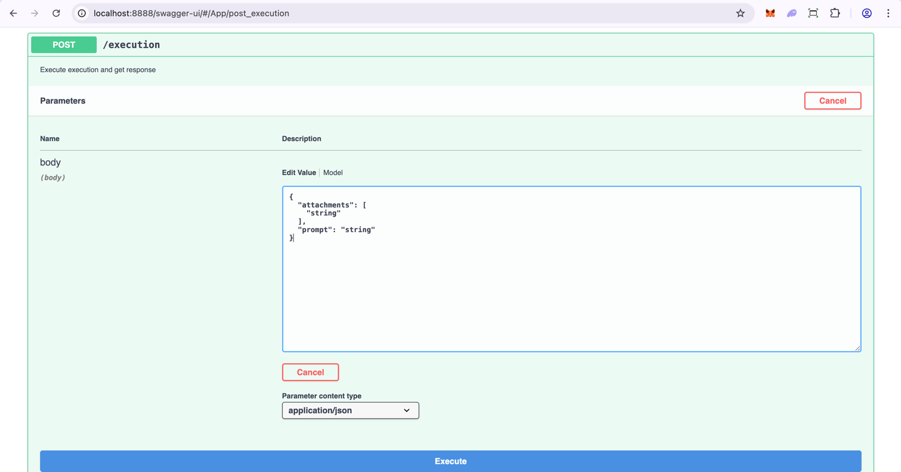

# 🚀 The AI Developer Challenge

### Make Something Insanely Great
Welcome. This isn’t just a coding task. This is a mission. A calling for the bold and curious—those who dare to think
differently. If you're ready to build something magical, something powerful, something *insanely great*—read on.

---

## 🌟 The Vision

Imagine this:  
A user types a simple idea —
> “Make me a glowing dragon standing on a cliff at sunset.”

And your app...

- Understands the request using a local LLM.
- Generates stunning visuals from text.
- Transforms that image into an interactive 3D model.
- Remembers it. Forever.

---

## 🎯 The Mission

Create an intelligent, end-to-end pipeline powered by Openfabric and a locally hosted LLM:

### Step 1: Understand the User

Use a local LLM like **DeepSeek** or **Llama** to:

- Interpret prompts
- Expand them creatively
- Drive meaningful, artistic input into the generation process

### Step 2: Bring Ideas to Life

Chain two Openfabric apps together:

- **Text to Image**  
  App ID: `f0997a01-d6d3-a5fe-53d8-561300318557`  
  [View on Openfabric](https://openfabric.network/app/view/f0997a01-d6d3-a5fe-53d8-561300318557)

- **Image to 3D**  
  App ID: `69543f29-4d41-4afc-7f29-3d51591f11eb`  
  [View on Openfabric](https://openfabric.network/app/view/69543f29-4d41-4afc-7f29-3d51591f11eb)

Use their **manifest** and **schema** dynamically to structure requests.

### Step 3: Remember Everything

Build memory like it matters.

- 🧠 **Short-Term**: Session context during a single interaction
- 💾 **Long-Term**: Persistence across sessions using SQLite, Redis, or flat files  
  Let the AI recall things like:

> “Generate a new robot like the one I created last Thursday — but this time, with wings.”

---

## 🛠 The Pipeline

User Prompt
↓
Local LLM (DeepSeek or LLaMA)
↓
Text-to-Image App (Openfabric)
↓
Image Output
↓
Image-to-3D App (Openfabric)
↓
3D Model Output

Simple. Elegant. Powerful.

---


## ✨ Example Experience

Prompt:
> “Design a cyberpunk city skyline at night.”

→ LLM expands into vivid, textured visual descriptions  
→ Text-to-Image App renders a cityscape  
→ Image-to-3D app converts it into depth-aware 3D  
→ The system remembers the request for remixing later

That’s not automation. That’s imagination at scale.

---

Given schema, stub implementation and all the details you should be able to figure out how eventing works but as an
extra hint (if needed) here is an example of calling and app get the value and save it as an image:
```python
    # Call the Text to Image app
    object = stub.call('c25dcd829d134ea98f5ae4dd311d13bc.node3.openfabric.network', {'prompt': 'Hello World!'}, 'super-user')
    image = object.get('result')
    # save to file
    with open('output.png', 'wb') as f:
        f.write(image)
```

## How to start
The application can be executed in two different ways:
* locally by running the `start.sh` 
* on in a docker container using `Dockerfile`

If all is fine you should be able to access the application on `http://localhost:8888/swagger-ui/#/App/post_execution` and see the following screen:



